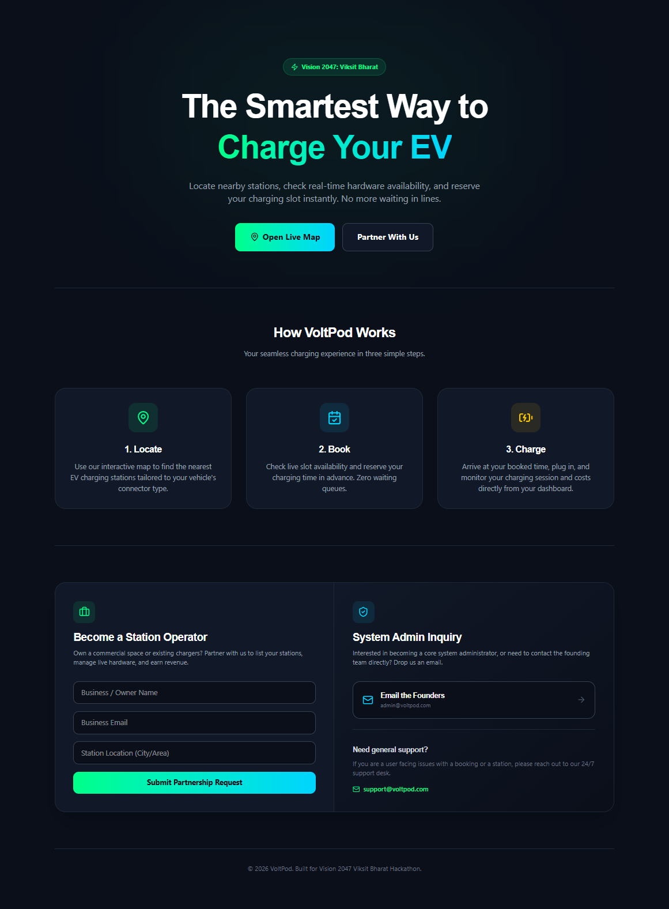
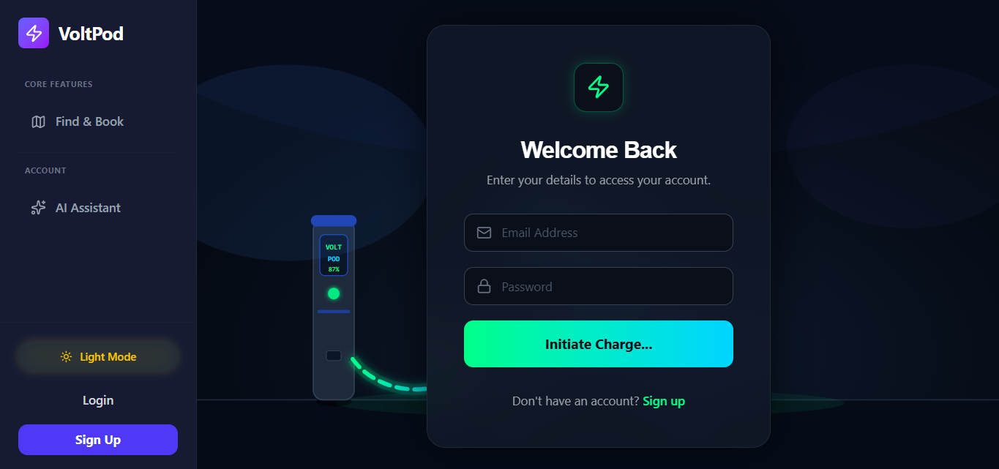
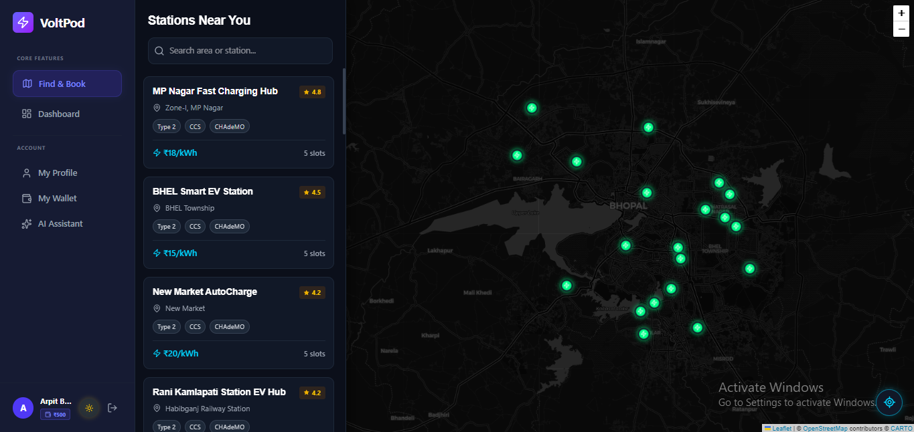
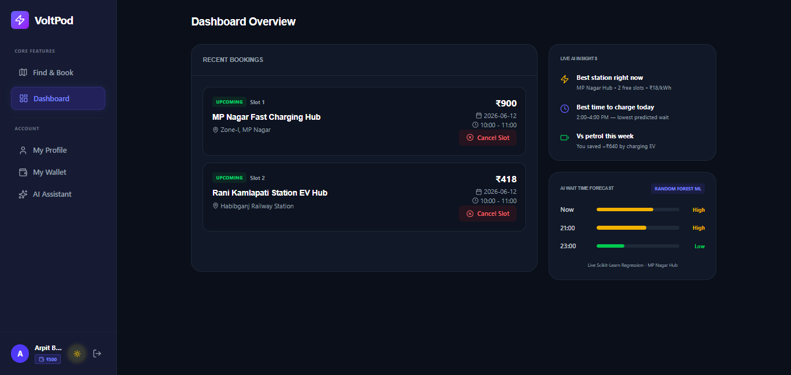
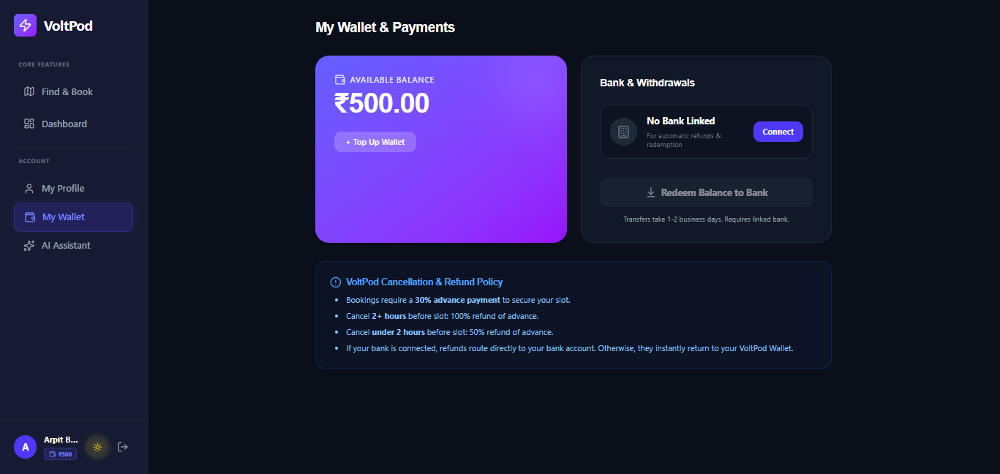
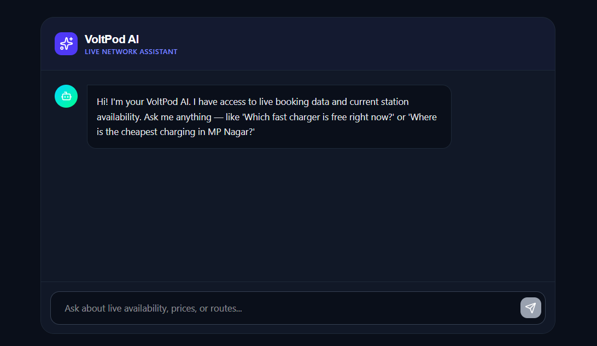

# VOLTPOD – AI-Powered EV Charging Platform

A full-stack web application designed for EV owners to easily find nearby charging stations, check real-time availability, and book slots.

## Technologies Used
* **Frontend**: React (Vite), Tailwind CSS v4, Framer Motion, Leaflet (Map), Recharts
* **Backend**: Node.js, Express.js, Socket.io
* **Database**: MongoDB (Mongoose)

## Setup Instructions

### 1. Prerequisites
- Node.js (v18+)
- MongoDB running locally on `mongodb://127.0.0.1:27017/` (or update `.env` in backend folder)

### 2. Backend Setup
```bash
cd backend
npm install
# Seed the database with simulated EV stations in Bhopal
node seed.js
# Start the backend server (runs on port 5000)
npm run dev
# OR: node server.js
```

### 3. Frontend Setup
Open a new terminal window:
```bash
cd frontend
npm install
# Start the Vite development server
npm run dev
```

### 4. Python ML Service Setup

Open a new terminal and run:

```bash
cd ml-service
pip install -r requirements.txt
python app.py
```
## Features
- **Real-time Map**: Browse charging stations around the city.
- **Dynamic Dashboard**: View your upcoming, active, and completed bookings.
- **Live Updates**: See slot availability update in real-time (powered by Socket.io).
- **Admin Panel**: Check analytics (revenue, busiest stations) and monitor bookings.
- **Role Based Access**: Register as a user. Admin can be set by manually changing the role in the DB to `admin`.

## System Architecture


## 📸 Screenshots

### 🏠 Home Page


### 🔐 Login Page


### 🗺️ Charging Stations Map


### 📊 Dashboard


### 💰 Wallet


### 🤖 AI Assistant


## Future Improvements

- Deploy full platform to production
- Enhanced AI charging recommendations
- Payment gateway integration
- EV route planning and navigation
- Push notifications for booking updates
- Charging station review system
- Multi-city support

Enjoy the premium dark-mode, futuristic interface designed for a modern EV charging experience.
